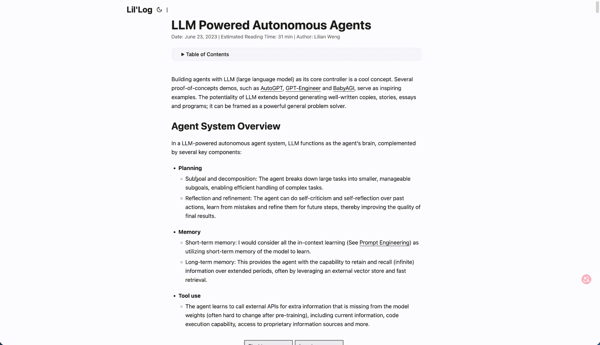

# InContext — Explain any selection, grounded in the whole page

**English** | [中文](#中文)

> **Select any sentence on a web page and get an explanation based on your LLM's understanding of the _entire article_ — not just the snippet.** Then ask follow‑up questions, in any language, with optional live web search and cited sources.

  

<p align="center"></p>

---

## Why InContext is different

Most "explain / translate selection" extensions send **only the highlighted snippet** to the model, so the explanation is out of context. **InContext extracts the whole article first** (via Mozilla Readability) and feeds it to the model as grounding, so it explains what the selection means **in this specific article** — the author's intent, implied meaning, what a term refers to here.

| | Selection translators | Full‑page summarizers | **InContext** |
|---|---|---|---|
| Explains the selected passage | ✅ | ❌ | ✅ |
| Uses the **whole article** as context | ❌ | ✅ | ✅ |
| **Explains the selection _using_ the whole article** | ❌ | ❌ | ✅ |
| Multi‑turn follow‑up on that passage | partial | ❌ | ✅ |
| Live web search with cited sources | ❌ | ❌ | ✅ |
| Bring your own key, 15+ providers | varies | varies | ✅ |

> **One line:** *Not "translate this sentence" — "tell me what this sentence actually means in this article."*

## Features

- **Whole‑page grounding** — the entire article is the context, not the isolated snippet.
- **Three‑step explanations** — term definition → meaning in context → example when helpful.
- **Multi‑turn chat** — keep asking about the same passage.
- **Any output language** — Chinese / English / 日本語 / …
- **Web search (hybrid)** — optionally pull live facts: a search engine fetches data, your main model writes the answer and **cites sources with [n] superscripts**. Context‑aware query generation (bilingual, disambiguates homonyms like *ReAct* vs *React*).
- **15+ model providers, BYOK** — DeepSeek, GLM, Kimi, Qwen, Doubao, OpenAI, Gemini, Claude (native), Grok, Mistral, Groq, OpenRouter, SiliconFlow… Keys stored locally, never sent to any third party. Each provider's key is saved separately.
- **Per‑tab** — each tab keeps its own conversation; switching tabs never overwrites or interrupts a running explanation.

## Install

### Chrome Web Store (recommended)
**[➕ Add to Chrome](https://chromewebstore.google.com/detail/incontext/kgafinomgkgjedolciacaclobeodfkei)** — one click, then open the side panel → ⚙ → choose a provider and paste your API key.

### From source (developer mode)
1. Download / clone this repo.
2. Open `chrome://extensions`, turn on **Developer mode**.
3. Click **Load unpacked**, pick the project folder (the one with `manifest.json`).
4. Pin the icon. Open the side panel → ⚙ → choose a provider and paste your API key.

## Usage

Select text on any page → click the floating **Explain / 解释** button (or right‑click menu / `Ctrl+Shift+E`) → the side panel explains it using the whole article → ask follow‑ups below. Toggle **🔍 Web** for live, cited answers.

**Try it on:** [Lilian Weng — LLM Powered Autonomous Agents](https://lilianweng.github.io/posts/2023-06-23-agent/) — highlight *ReAct* and watch it explain the LLM pattern (not the React framework).

## Architecture

```
Content script   detect selection → floating button → Readability extracts full article → send to background
       │
Background       store selection per‑tab/window → open Side Panel → notify
       │
Side Panel       (optional) generate search query → web search → build prompt(full article + selection + sources)
                 → stream from your model → multi‑turn UI with [n] citations
```

Core grounding prompt: `src/prompt.js`. Web search: `src/search.js`. Providers / Anthropic adapter: `src/llm.js` & `src/config.js`. No build step — plain MV3 + vanilla JS.

## FAQ

**Is my data private?** Yes. It's BYOK — your API key and conversations stay in your browser's local storage. The page text goes only to the model endpoint _you_ configured.

**Which models can I use?** Any OpenAI‑compatible endpoint plus native Anthropic Claude — 15+ presets, or add a custom one.

**Does it work on PDFs / local files?** Local `file://` pages need "Allow access to file URLs" enabled for the extension; some Chrome internal pages can't be accessed at all.

## License

MIT

---
---

# 中文

[English](#incontext--explain-any-selection-grounded-in-the-whole-page) | **中文**

> **划选网页中的任意一段，基于大模型对【整篇文章】的理解给出解释**——不是孤立翻译那一句。还能就这段**多轮追问**、**多语种输出**、**联网补充并标注来源**。

<p align="center"></p>

## 为什么不一样

普通"划词翻译/解释"插件只把**选中的那一小段**发给模型，解释脱离语境。**InContext 先用 Readability 抽取整篇文章**喂给模型做背景，所以它解释的是这段话**在这篇文章里**到底什么意思——作者意图、隐含信息、专有名词在此处的真实所指。

| | 划词翻译 | 全文总结 | **InContext** |
|---|---|---|---|
| 解释选中段 | ✅ | ❌ | ✅ |
| 拿**整篇文章**当上下文 | ❌ | ✅ | ✅ |
| **用整篇文章来解释选中段** | ❌ | ❌ | ✅ |
| 就该段多轮追问 | 部分 | ❌ | ✅ |
| 联网搜索 + 标注来源 | ❌ | ❌ | ✅ |
| 自带 key、15+ 服务商 | 不一定 | 不一定 | ✅ |

> **一句话：** 不是"翻译这句话"，而是"告诉我这句话在这篇文章里到底什么意思"。

## 功能

- **基于全文**：整篇文章是上下文，而非孤立片段。
- **三步式解释**：术语释义 → 全文语境 → 必要时举例。
- **多轮追问**：就同一段持续提问。
- **多语种输出**：中文 / English / 日本語 …
- **联网（混合模式）**：可选实时联网——搜索引擎取数据，你的主模型作答并**用 [n] 上标标注来源**。检索词结合上下文生成、中英双语、自动消歧（如 *ReAct* ≠ *React*）。
- **15+ 模型，自带 key**：DeepSeek、GLM、Kimi、通义、豆包、OpenAI、Gemini、Claude（原生直连）、Grok、Mistral、Groq、OpenRouter、硅基流动… key 只存本地、不传第三方，每家各存各的。
- **按标签页独立**：每个 tab 各记各的对话，切换不覆盖、不打断正在跑的解释。

## 安装

**Chrome 应用商店（推荐）：**
**[➕ 一键添加到 Chrome](https://chromewebstore.google.com/detail/incontext/kgafinomgkgjedolciacaclobeodfkei)** —— 装好后开侧栏 → ⚙ → 选服务商、填你的 API Key。

**开发者模式加载（备选）：**
1. 下载/克隆本仓库。
2. 打开 `chrome://extensions`，开启**开发者模式**。
3. 点**加载已解压的扩展程序**，选含 `manifest.json` 的文件夹。
4. 固定图标。开侧栏 → ⚙ → 选服务商、填你的 API Key。

## 用法

任意网页划选文字 → 点浮出的「解释」按钮（或右键菜单 / `Ctrl+Shift+E`）→ 侧栏结合全文解释 → 在下方继续追问。点亮「🔍 联网」获取实时、带来源的回答。

**试用建议：** 打开 [Lilian Weng《LLM Powered Autonomous Agents》](https://lilianweng.github.io/posts/2023-06-23-agent/)，划选 *ReAct*，看它解释成大模型的"推理+行动"范式（而不是前端 React）。

## 常见问题

**隐私安全吗？** 安全。BYOK——你的 key 和对话只存在浏览器本地；网页正文只发往**你自己配置**的模型接口，无任何后端。

**支持哪些模型？** 任意 OpenAI 兼容接口 + 原生 Anthropic Claude，15+ 预设，也可自定义。

**支持 PDF / 本地文件吗？** 本地 `file://` 页面需给扩展开启"允许访问文件网址"；部分 Chrome 内置页面无法访问。

## 许可证

MIT
